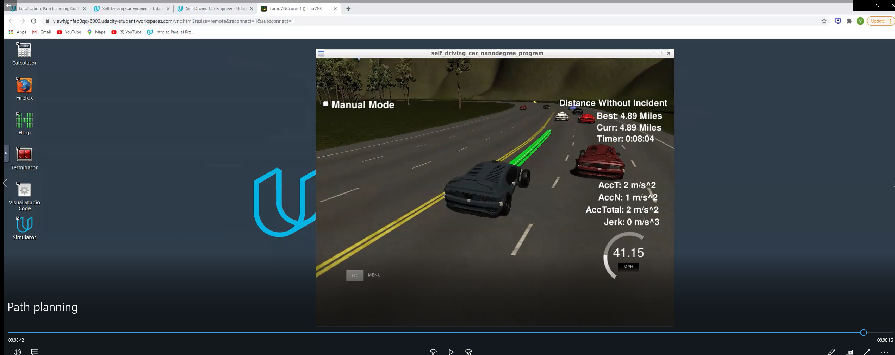

# CarND-Path-Planning-Project
Self-Driving Car Engineer Nanodegree Program
   
### Details of implementation of code.
Path planning is the process to generate path to reach destination safely and autonomously. Path planning for city is a much more complicated problem as compared to highway. In this project, I did path planning for highway. The path planning consists of three major components:

1. Prediction of other vehicles around the ego vehicle
2. What should the car do in next 1 second?
3. Generate a smooth trajectory that the controller can follow

#### Prediction
Prediction is based on the information of neighboring vehicles. This information is provided by helper.h file. It filters out the vehicles which are in the range of 100m of ego vehicle first and then use the predicted neighboring vehicles' location which is based on speed, direction and the lane in which they are travelling.

#### Behaviour Planning
In my code, the car can drive at 49 mph if there is no car in front and it can choose to stay in the same lane or change the lane if possible. I used finite state machines (FSM) to achieve this. I used a vector of reference velocity and chosen lane to represent the states 'lane change to left', 'keep in lane' or 'lane change to right'

#### Trajectory

Finally, the trajectory is geneerated and cost of trajectory is calculated to find the least-cost trajectory. I used spline to generate smooth trajectories as discussed in one of Q&A of project. In the calculation, I considered lane change, accelerationa and speed

### Results

I was able to drive the car for more than 4.5 miles without any accident. Please refer to the image as follows:

